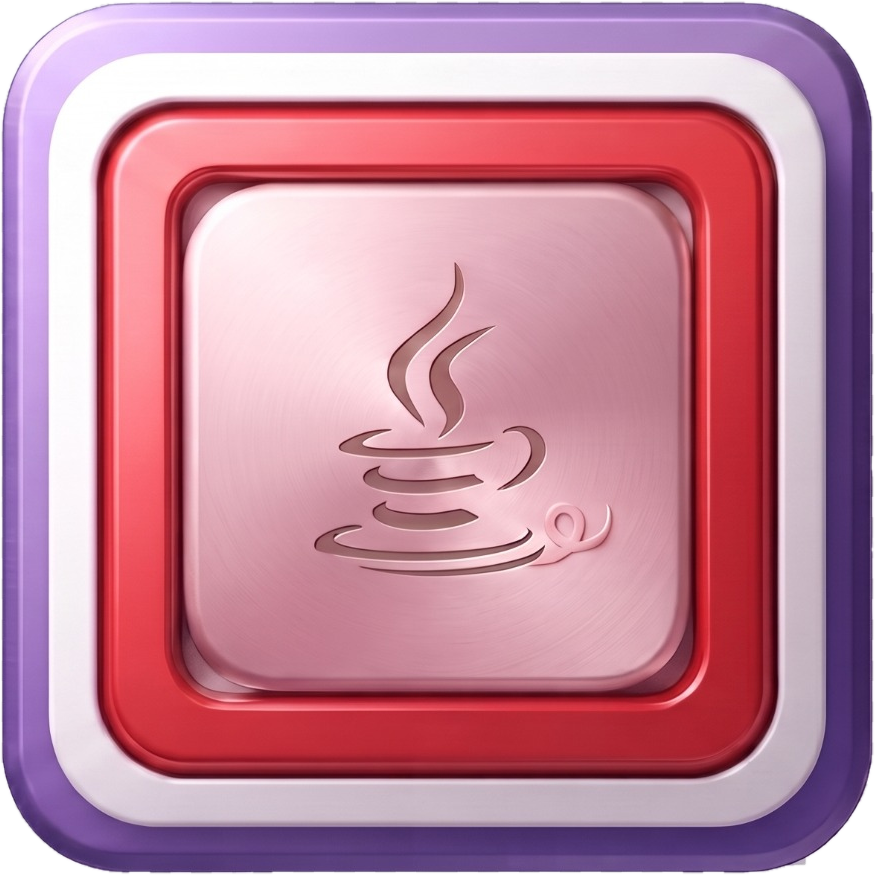

# XMC Look — Icon Greeting

## Welcome

**Welcome to XMC Look.**

An icon is a small promise: it should tell you where you are, what you can do, and what happens next—without demanding a paragraph of explanation.

XMC Look presents its icon vocabulary as part of the tool's visual identity: **precise, technical, restrained, and immediately readable.** The design favors clear silhouettes, deliberate geometry, and enough visual space for every symbol to remain useful rather than ornamental.

## The Icon Set

The XMC Look image library presents the selected public icon family below. The current public presentation is **Icon Set 4 — Fourth Collection**. It is preserved under `tools/xmc/images/`, with its transparent master artwork and production-oriented trimmed sizes.

### Icon Set 4 — Fourth Collection

**Icon Set 4 — Fourth Collection** is the current public icon collection for XMC Look. Its transparent master provides the reference artwork, accompanied by the 12, 16, 24, 32, and 48 px trimmed variants for interface and packaging use.

[Open Icon Set 4 — Fourth Collection](images/set-4/)

## Visual Character

The XMC Look treatment favors:

- clean geometric forms;
- strong figure/ground separation;
- restrained use of detail;
- consistent proportions and stroke language;
- scalable artwork through transparent master images;
- recognizable forms at both small and large interface sizes;
- accessible names and descriptions for interface use.

The selected collection retains an important practical convention: **the master artwork is retained, while production-oriented trimmed sizes are provided alongside it.** This makes the public gallery useful both as a visual introduction and as a reference for implementation.

## Tool Identity

XMC Look is a developer-facing tool, so its visual language should remain functional first. Icons should help distinguish source, inspection, navigation, configuration, execution, and system operations without turning the interface into decoration.

The result should feel **quietly technical**: capable enough for a development environment, but approachable enough that a person can learn the vocabulary naturally.

## A Small Greeting

> **Look closely. Build deliberately.**
>
> XMC Look treats the interface as part of the tool—not merely a frame around it.

Every symbol has a job. Every visual distinction should help the user form a reliable mental model of the program.

## Public Icon Standard

For public-facing presentation, icons should:

1. retain their original project meaning;
2. remain visually consistent as a family;
3. include useful accessibility text when embedded in interfaces;
4. scale cleanly across supported UI sizes;
5. avoid unnecessary visual complexity;
6. preserve sufficient contrast against the XMC Look interface background;
7. retain a transparent master for future rendering and packaging.

## Relationship to XMC Look

This document is the visual greeting and icon-gallery companion for `tools/xmc`. It intentionally presents **Icon Set 4 — Fourth Collection** from `tools/xmc/images/set-4/` so the public repository communicates the current visual system directly rather than retaining the earlier three-set presentation.

Where an icon asset exists in a tool directory, public documentation should prefer showing the actual repository asset rather than substituting an unrelated illustration.

## Project Note

This document describes the project's interface vocabulary and visual intent. It does not by itself establish trademark ownership, licensing terms, or technical guarantees; those remain governed by the repository's applicable license and project documentation.
