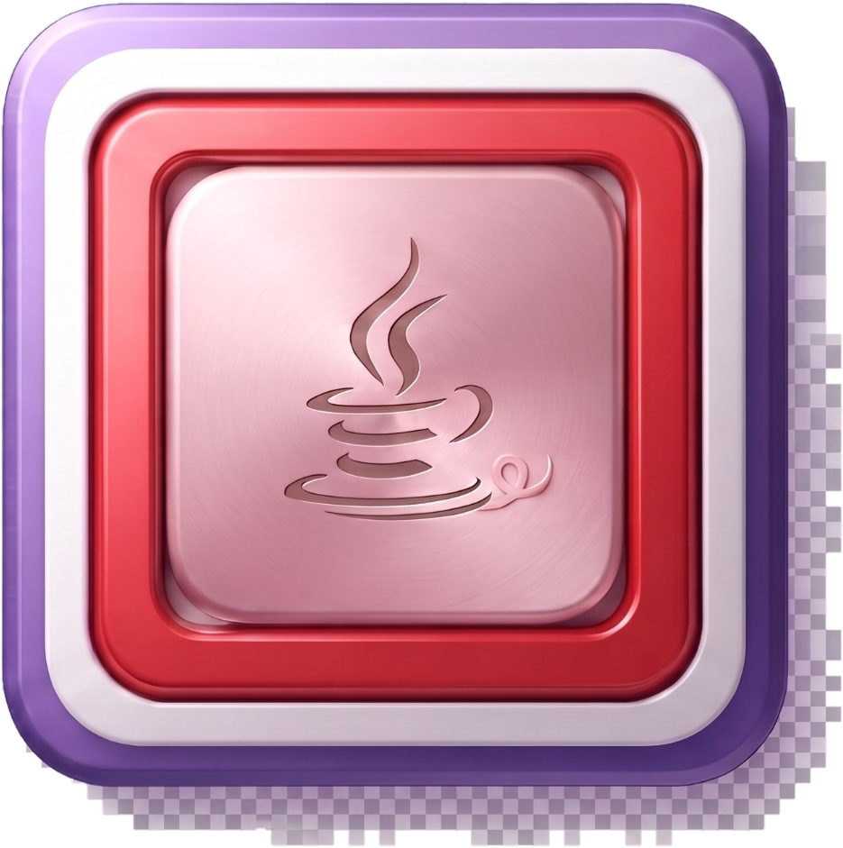
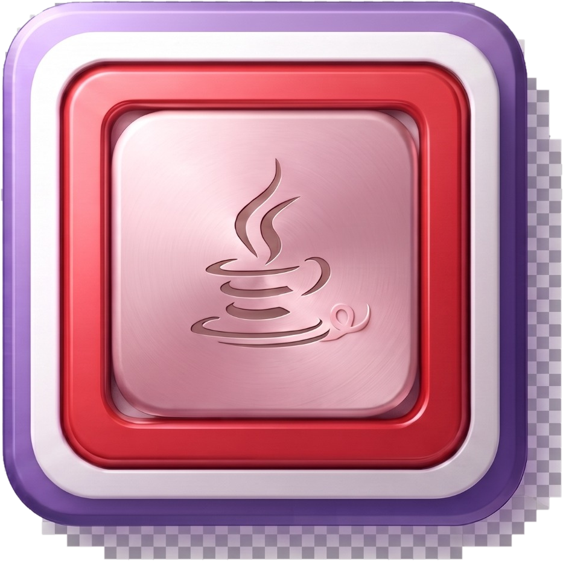

# xmcLook — Icon Greeting

## Welcome

**Welcome to xmcLook.**

An icon is a small promise: it should tell you where you are, what you can do, and what happens next—without demanding a paragraph of explanation.

xmcLook presents its icon vocabulary as part of the tool's visual identity: **precise, technical, restrained, and immediately readable.** The design favors clear silhouettes, deliberate geometry, and enough visual space for every symbol to remain useful rather than ornamental.

## The Icon Set

The xmcLook image library currently presents **four icon sets**. Each set is preserved as its own visual family under `tools/xmc/images/`, with trimmed raster sizes and a transparent master artwork file. The four sets are presented here at the public-facing level so visitors can see the vocabulary before entering the implementation directories.

### Icon Set 1 — First Collection

**Set 1** is the first collection in the xmcLook icon sequence. Its transparent master is the reference presentation for this family; the same set is also supplied in 12, 16, 24, 32, and 48 px trimmed forms.

[Open Icon Set 1](images/set-1/)

### Icon Set 2 — Second Collection

**Set 2** is the second collection, maintained as a distinct visual variant while retaining the common xmcLook icon vocabulary and sizing system. Its directory contains the transparent master plus the 12, 16, 24, 32, and 48 px forms.

[Open Icon Set 2](images/set-2/)

### Icon Set 3 — Third Collection

**Set 3** is the third collection in the sequence. It follows the same public asset discipline: transparent master artwork accompanied by trimmed interface sizes from 12 through 48 px.

[Open Icon Set 3](images/set-3/)

### Icon Set 4 — Fourth Collection

**Set 4** is the fourth collection and completes the current four-set presentation. Its transparent master is accompanied by the same 12, 16, 24, 32, and 48 px trimmed variants.

[Open Icon Set 4](images/set-4/)

## Visual Character

The xmcLook treatment favors:

- clean geometric forms;
- strong figure/ground separation;
- restrained use of detail;
- consistent proportions and stroke language;
- scalable artwork through transparent master images;
- recognizable forms at both small and large interface sizes;
- accessible names and descriptions for interface use.

The four sets share an important practical convention: **the master artwork is retained, while production-oriented trimmed sizes are provided alongside it.** This makes the public gallery useful both as a visual introduction and as a reference for implementation.

## Tool Identity

xmcLook is a developer-facing tool, so its visual language should remain functional first. Icons should help distinguish source, inspection, navigation, configuration, execution, and system operations without turning the interface into decoration.

The result should feel **quietly technical**: capable enough for a development environment, but approachable enough that a person can learn the vocabulary naturally.

## A Small Greeting

> **Look closely. Build deliberately.**
>
> xmcLook treats the interface as part of the tool—not merely a frame around it.

Every symbol has a job. Every visual distinction should help the user form a reliable mental model of the program.

## Public Icon Standard

For public-facing presentation, icons should:

1. retain their original project meaning;
2. remain visually consistent as a family;
3. include useful accessibility text when embedded in interfaces;
4. scale cleanly across supported UI sizes;
5. avoid unnecessary visual complexity;
6. preserve sufficient contrast against the xmcLook interface background;
7. retain a transparent master for future rendering and packaging.

## Relationship to xmcLook

This document is the visual greeting and icon-gallery companion for `tools/xmc`. It intentionally presents the four image collections from `tools/xmc/images/` so the public repository communicates the visual system directly rather than merely naming the assets.

Where an icon asset exists in a tool directory, public documentation should prefer showing the actual repository asset rather than substituting an unrelated illustration.

## Project Note

This document describes the project's interface vocabulary and visual intent. It does not by itself establish trademark ownership, licensing terms, or technical guarantees; those remain governed by the repository's applicable license and project documentation.
