# Ubuntu White — Icon Greeting 2

## Desktop Greeting — Set 001

This document extends the Ubuntu White icon greeting to the **12-icon desktop set** used by the Gradle boot-to-Desktop synthesizer.

The source of truth for this desktop set is:

`images/desktop-icons/set-001/`

## Desktop Icon Reference

The repository's original icon artwork is referenced directly below. For a professional, consistent presentation, each icon is displayed in the same **96 × 96 px reference frame**. The source PNG files are not altered by this documentation view; the uniform frame is a presentation convention for the desktop profile and icon gallery.

| # | Desktop Icon | Reference Artwork |
|---:|---|---|
| 1 | Desktop Icon 001 | 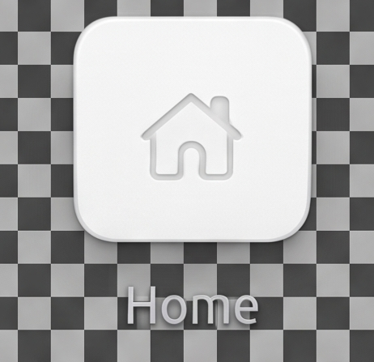 |
| 2 | Desktop Icon 002 | 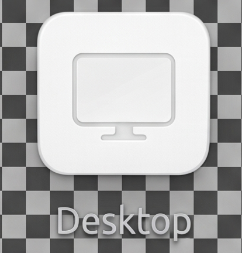 |
| 3 | Desktop Icon 003 | 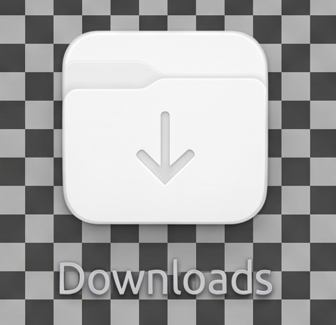 |
| 4 | Desktop Icon 004 | 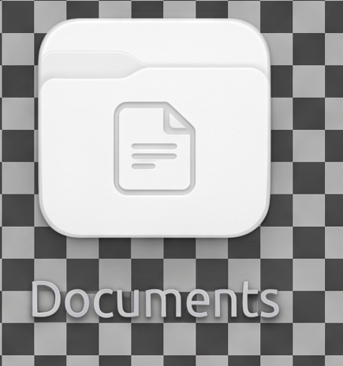 |
| 5 | Desktop Icon 005 | 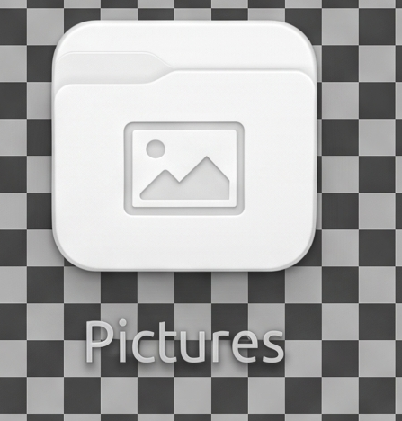 |
| 6 | Desktop Icon 006 | 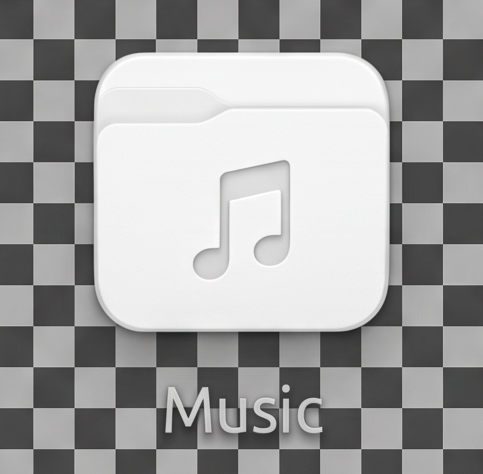 |
| 7 | Desktop Icon 007 | 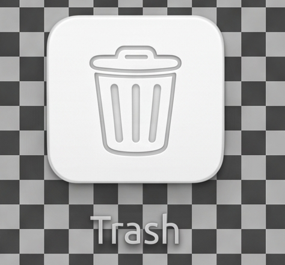 |
| 8 | Desktop Icon 008 | 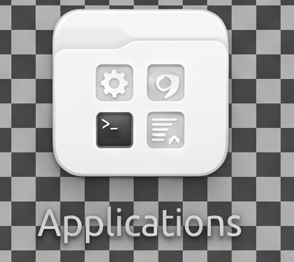 |
| 9 | Desktop Icon 009 | 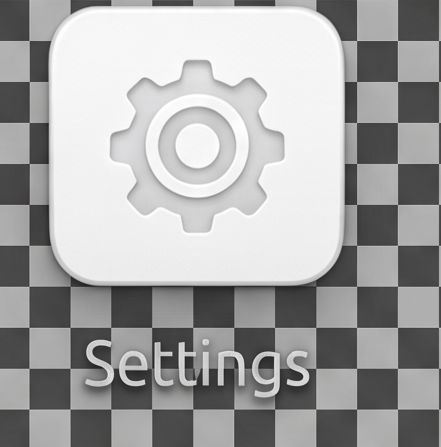 |
| 10 | Desktop Icon 010 | 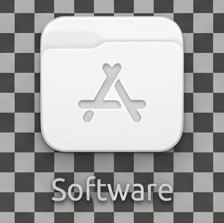 |
| 11 | Desktop Icon 011 | 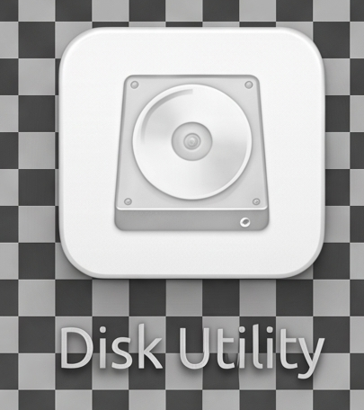 |
| 12 | Desktop Icon 012 | 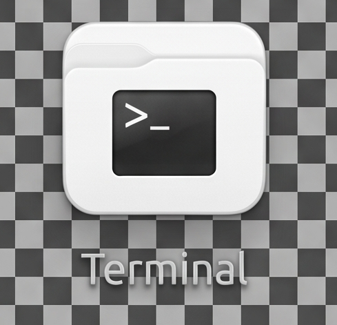 |

## Gradle Boot-to-Desktop Reference

The twelve images above are designated as the desktop icon assets for the **Gradle boot-to-Desktop synthesizer**. A Java-based desktop profile may use this document as the visual asset reference when constructing the desktop presentation.

The synthesizer should reference the repository assets rather than creating substitute artwork. The set is therefore treated as a stable visual input to the desktop profile.

## Professional Icon Sizing Convention

For the reference gallery, all twelve icons use the same **96 × 96 px presentation frame**. This provides a consistent visual rhythm and makes differences in the original artwork easier to evaluate without changing the source files.

For actual desktop rendering, the Java/Gradle profile may select a platform-appropriate native size such as **48 × 48, 64 × 64, or 96 × 96 px**, while preserving aspect ratio and transparency. The reference frame is not a requirement that every operating-system surface render at 96 px.

## Ubuntu White Presentation

The desktop presentation continues the Ubuntu White principles established by `IconGreeting.md`:

- clear, quiet desktop presentation;
- generous visual space;
- recognizable icon silhouettes;
- consistent icon presentation;
- practical rendering at desktop sizes;
- direct repository provenance for the source artwork;
- Java/Gradle compatibility for the desktop synthesizer.

## Relationship to IconGreeting.md

`IconGreeting.md` remains the original Ubuntu White greeting and icon-language document. This **IconGreeting2.md** document is its incremental desktop-set companion and specifically records the twelve `set-001` PNG assets.

## Asset Provenance

The twelve files are maintained under `images/desktop-icons/set-001/` on the repository `main` branch. The set contains `icon-001.png` through `icon-012.png`.

No claim is made here that these assets are official Ubuntu or GNOME artwork. They are repository project assets intended for the Ubuntu White desktop presentation.
