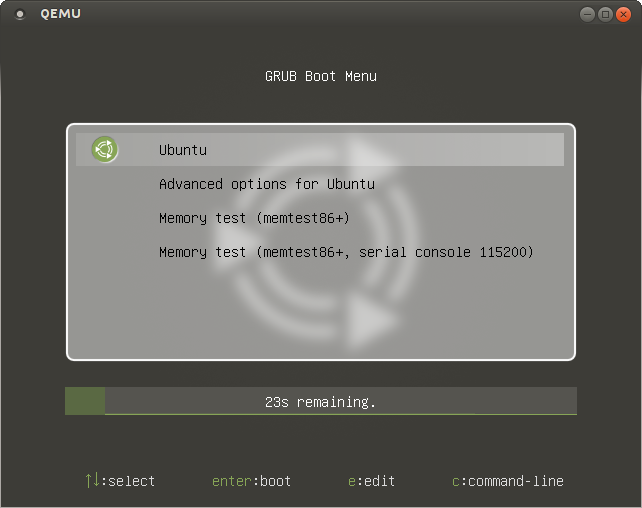

grub2-themes-ubuntustudio
=========================

Forked from grub2-themes-ubuntu-mate

Except where otherwise **noted**, content of grub2-themes-ubuntustudio by Ivan Pejić aka nadrimajstor and Erich Eickmeyer is licensed under a [Creative Commons Attribution-ShareAlike 4.0 International License](http://creativecommons.org/licenses/by-sa/4.0/)
***



###Debian package install
```bash
sudo apt-get update && sudo apt-get -y install git devscripts debhelper
git clone git clone https://git.launchpad.net/grub2-theme-ubuntustudio
cd grub2-theme-ubuntustudio
debuild
sudo dpkg --install ../grub2-theme-ubuntu-mate_0.1_all.deb
```
